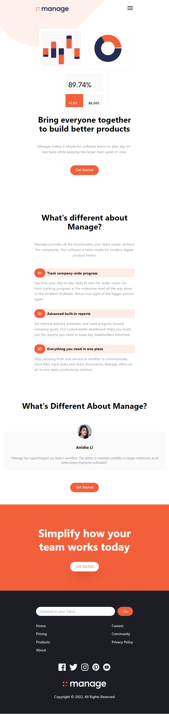

# First Tailwind Css Project

This is a Project from [Brad Traversy](https://github.com/bradtraversy). they upload video on youtube with title [Tailwind Crash Course | Project From Scratch](https://www.youtube.com/watch?v=dFgzHOX84xQ) ,i just watch the video and copy it :),for learning tailwind OFCOURCE!

## Table of contents

- [Overview](#overview)
  - [Screenshot](#screenshot)
  - [Built with](#built-with)

## Overview

### Screenshot

#### Desktop Screen

#### Mobile Screen

### Built with

- Semantic HTML5 markup
- Tailwind CSS
- JS
